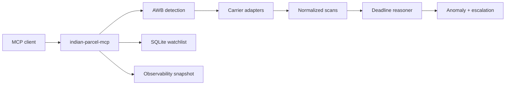
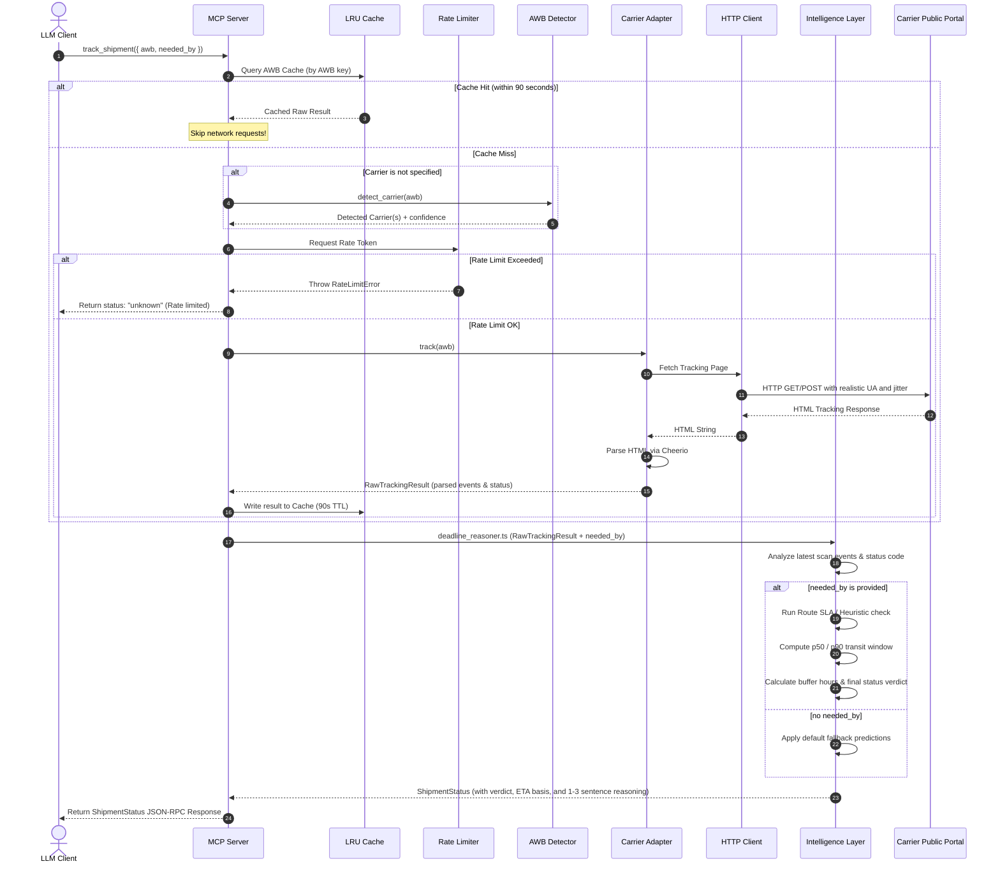

<h1 align="center">indian-parcel-mcp</h1>

<p align="center">
  <strong>Deadline-aware shipment intelligence for Indian couriers, exposed as an MCP server.</strong>
</p>

<p align="center">
  Track an AWB, understand the delivery risk, estimate the buffer against a hard deadline, and get escalation guidance your AI client can explain in plain language.
</p>

<p align="center">
  <b>India-first</b> · <b>MCP-native</b> · <b>Deadline-aware</b> · <b>Local-first</b>
</p>

<div align="center">

[](package.json)
[](https://github.com/alok-19/parcel-mcp/actions/workflows/ci.yml)
[](https://nodejs.org/)
[](https://modelcontextprotocol.io/)
[](https://www.typescriptlang.org/)
[](LICENSE)

</div>

<br />

## Why This Exists

Most tracking tools answer one narrow question: "what did the carrier last say?" For high-stakes shipments, that is not enough.

`indian-parcel-mcp` turns Indian courier tracking into structured judgment for LLM clients. It does not just expose scan events; it returns a verdict such as `on_track`, `at_risk`, `delayed`, `stuck`, `exception`, or `unknown`, with a conservative delivery window, deadline buffer, anomaly signals, and escalation next steps.

The project was born from a real deadline-sensitive shipment: visa documents moving from Muzaffarpur to Bangalore with an embassy clock running. Generic trackers could show JSON. They could not say whether the parcel was likely to arrive in time, or what to do next.

## What It Does

| Capability | What your MCP client gets |
|---|---|
| Carrier detection | AWB-pattern detection for Blue Dart, DTDC, Delhivery, and India Post / Speed Post. |
| Live tracking | Best-effort public portal tracking through carrier adapters, with safe `unknown` fallback when blocked or unstable. |
| Normalization | Carrier-specific scan text mapped into consistent shipment phases and status verdicts. |
| Deadline reasoning | `needed_by` support with predicted delivery windows, confidence, and `buffer_hours`. |
| Anomaly detection | Signals for stale scans, low scan density, RTO, exception flags, and stuck out-for-delivery cases. |
| Escalation guidance | Carrier-aware playbooks with privacy-safe scripts and contact paths. |
| Local watchlist | SQLite-backed watch storage with explicit refresh, change detection, and persisted monitoring state. |
| Observability | Lightweight health snapshot for carrier failures, cache hits, parser drift, and watch refresh runs. |

## Supported Carriers

| Carrier | AWB shape | Phase 1 behavior | Parser tests |
|---|---|---|---:|
| Blue Dart | `8-11` digits | Live best-effort tracking | Yes |
| DTDC | `1-2` letters + `7-9` digits | Best-effort adapter with conservative fallback | Yes |
| Delhivery | `14` digits | Best-effort adapter with conservative fallback | Yes |
| India Post / Speed Post | `XX#########IN` | Best-effort adapter with conservative fallback | Yes |

Carrier portals change often and may block automated access. This server treats uncertainty as a first-class result: when it cannot fetch or parse confidently, it returns a structured `unknown` response instead of inventing confidence.

## Quickstart

Clone and build the server:

```bash
npm install
npm run build
```

Run the MCP server over stdio:

```bash
node dist/src/server.js
```

During development, run it directly with `tsx`:

```bash
npm run dev
```

After the package is published, the intended install path is:

```bash
npx -y indian-parcel-mcp
```

## Add To Your MCP Client

### Claude Desktop

Add this to `claude_desktop_config.json`:

```json
{
  "mcpServers": {
    "indian-parcel": {
      "command": "node",
      "args": ["/Users/alok/Documents/SourceCode/parcel-mcp/dist/src/server.js"]
    }
  }
}
```

After publishing, switch the command to `npx`:

```json
{
  "mcpServers": {
    "indian-parcel": {
      "command": "npx",
      "args": ["-y", "indian-parcel-mcp"]
    }
  }
}
```

A ready-to-paste local config lives in [examples/claude-desktop-config.json](examples/claude-desktop-config.json).

### Codex

```bash
codex mcp add indian-parcel -- node /Users/alok/Documents/SourceCode/parcel-mcp/dist/src/server.js
```

After publishing:

```bash
codex mcp add indian-parcel -- npx -y indian-parcel-mcp
```

Manual TOML config:

```toml
[mcp_servers.indian-parcel]
command = "node"
args = ["/Users/alok/Documents/SourceCode/parcel-mcp/dist/src/server.js"]
```

### OpenCode

```json
{
  "mcp": {
    "indian-parcel": {
      "type": "local",
      "command": ["node", "/Users/alok/Documents/SourceCode/parcel-mcp/dist/src/server.js"],
      "enabled": true
    }
  }
}
```

### Antigravity CLI / Editor

Add this to your Antigravity MCP config:

```json
{
  "mcpServers": {
    "indian-parcel": {
      "command": "node",
      "args": ["/Users/alok/Documents/SourceCode/parcel-mcp/dist/src/server.js"]
    }
  }
}
```

## Ask It Like This

Once connected, ask your MCP client directly:

```text
Track this India package with indian-parcel: 21038951172
```

```text
Use track_shipment for AWB 18033769504. It must arrive before 2026-05-26T12:00:00+05:30.
```

```text
Diagnose this shipment and tell me whether I should escalate today: EA123456789IN
```

The server descriptions intentionally guide clients toward Indian couriers for bare numeric AWBs, instead of drifting to unrelated non-India carriers.

## Tool Reference

| Tool | Purpose |
|---|---|
| `track_shipment` | Track an Indian shipment, normalize carrier events, and return deadline-aware reasoning. |
| `track_india_parcel` | Alias optimized for clients that respond better to explicit India package wording. |
| `detect_carrier` | Infer the likely Indian carrier from an AWB. |
| `detect_india_carrier` | India-specific carrier-detection alias. |
| `estimate_eta` | Estimate route-level delivery windows from carrier and PIN codes. |
| `diagnose_shipment` | Track, detect anomalies, and generate escalation guidance. |
| `watch_shipment` | Persist a shipment in the local SQLite watchlist. |
| `list_watches` | List watched shipments and their last known monitoring state. |
| `refresh_watches` | Refresh one watch or all watches, detect changes, and persist results. |
| `remove_watch` | Remove a watch from local storage. |
| `get_observability` | Inspect carrier health, parser drift, and watch refresh counters. |

## Example Outputs

### Track A Deadline-Sensitive Shipment

Input:

```json
{
  "awb": "1234567890",
  "needed_by": "2026-05-26T12:00:00+05:30",
  "origin_pincode": "842001",
  "destination_pincode": "560001"
}
```

Output shape:

```json
{
  "awb": "1234567890",
  "carrier": "bluedart",
  "status": "at_risk",
  "normalized_phase": "in_transit",
  "current_location": "Delhi Hub",
  "last_scan_at": "2026-05-24T08:10:00.000+05:30",
  "predicted_delivery": {
    "p50": "2026-05-25T20:10:00.000+05:30",
    "p90": "2026-05-26T08:10:00.000+05:30",
    "confidence": 0.82,
    "basis": "historical_data"
  },
  "needed_by": "2026-05-26T12:00:00+05:30",
  "buffer_hours": 3.8,
  "events": [],
  "reasoning": "Currently at Delhi Hub with latest scan ... The delivery buffer versus the deadline is about 4 hours.",
  "fetched_at": "2026-05-24T09:00:00.000+05:30"
}
```

### Diagnose A Shipment

```json
{
  "awb": "1234567890",
  "needed_by": "2026-05-26T12:00:00+05:30",
  "purpose": "visa documents"
}
```

Returns:

```json
{
  "status": {},
  "anomalies": [
    {
      "type": "stale_scan",
      "severity": "warning",
      "description": "Latest scan is older than the configured threshold.",
      "detected_at": "2026-05-24T09:00:00.000Z"
    }
  ],
  "escalation_playbook": [
    {
      "step": 1,
      "action": "Contact carrier support with AWB and latest scan details.",
      "channel": "phone",
      "expected_outcome": "Confirm whether the shipment is moving and request a delivery commitment."
    }
  ],
  "reasoning": "Detected 1 anomaly signal(s): stale_scan. Currently at ..."
}
```

### Watch And Refresh

```json
{
  "awb": "1234567890",
  "needed_by": "2026-05-26T12:00:00+05:30",
  "label": "Visa documents"
}
```

Then refresh later:

```json
{}
```

`refresh_watches` returns each checked watch, whether the state changed, the latest status, anomaly signals, and any refresh error.

## Architecture



The server is intentionally local-first. It runs over stdio, stores watchlist state in local SQLite, validates inputs and outputs with Zod schemas, and keeps carrier failures observable without leaking sensitive shipment data.

### 🌊 Complete End-to-End Tracking Flow

When an LLM requests tracking details for a shipment, the request goes through cache lookup, rate limiting, selective HTML scraping, and intelligence-layer reasoning before returning a final parsed verdict.




## Design Principles

- Prefer one reliable carrier path over many fragile integrations.
- Return structured uncertainty instead of pretending blocked carrier portals worked.
- Keep responses LLM-friendly: compact JSON plus reasoning that can be paraphrased directly.
- Treat ETA confidence as operational guidance, not a statistical guarantee.
- Redact sensitive shipment data from logs and public escalation text.
- Protect parsers with carrier fixtures and protocol-level tests.

## Development

```bash
npm install
npm run lint
npm run test
npm run build
```

Useful commands:

```bash
npm run typecheck
npm run pack:check
```

The local SQLite watchlist defaults to `parcel.sqlite` in the project root. Override it with `PARCEL_MCP_DB_PATH`; `BHARAT_LOGISTICS_DB_PATH` is also supported for backward compatibility. Set `LOG_LEVEL` to tune structured logging.

The test suite covers carrier parsers, AWB detection, SLA lookup, deadline verdicts, anomaly detection, escalation logic, observability, watchlist monitoring, and MCP protocol schemas.

## Contributing Carriers

1. Add an AWB regex entry in [data/awb_patterns.json](data/awb_patterns.json).
2. Implement a `CarrierAdapter` in `src/carriers/`.
3. Add contact metadata in [data/carrier_contacts.json](data/carrier_contacts.json).
4. Add fixture HTML and parser tests under [tests/carriers](tests/carriers).
5. Document whether live support is full or best-effort.

## Roadmap

| Stage | Focus |
|---|---|
| Phase 1 | Reliable India-focused MCP core, Blue Dart vertical slice, parser fixtures, watchlist, explicit refresh, and observability. |
| Phase 2 | Broader live carrier coverage where feasible, notification hooks, expanded SLA data, and HTTP transport for remote MCP clients. |
| Phase 3 | SMS and email ingestion, community-reviewed SLA contributions, richer parser-drift triage, dashboarding, and MCP registry submission. |

## Package Name

The npm package for this project is `indian-parcel-mcp`.

## License

MIT [LICENSE](LICENSE).
