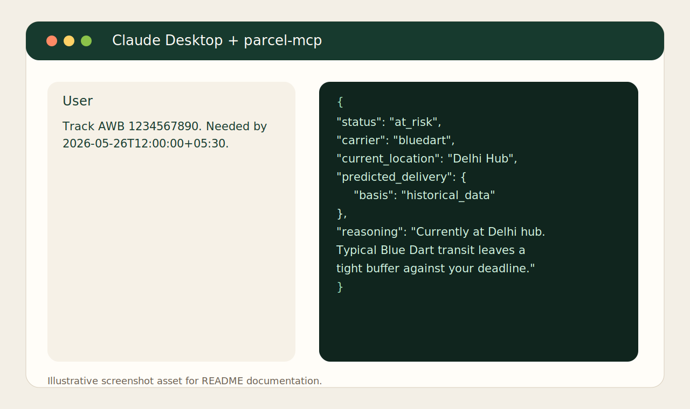

# parcel-mcp

`parcel-mcp` is an India-first Model Context Protocol server for shipment tracking, deadline-aware ETA reasoning, anomaly detection, and escalation guidance. It is built for LLM clients that need judgment, not just raw courier scan events.



## Why this exists

> I was tracking my partner's visa documents from Muzaffarpur to Bangalore against a tight embassy deadline. Blue Dart's app is clunky, AfterShip doesn't understand Indian carriers deeply, and TrackMage gives you JSON but no judgment about whether your shipment will actually arrive in time.

This project turns public Indian courier tracking pages into an MCP-native intelligence layer. Instead of only exposing scans, it returns a verdict such as `on_track`, `at_risk`, or `delayed`, a conservative delivery window, and reasoning that an LLM can paraphrase directly for a user.

## Phase 1 Support

| Carrier | AWB format | Live support | Fixture-backed parser tests |
|---|---|---:|---:|
| Blue Dart | 8-11 digits | Yes, best-effort | Yes |
| DTDC | 1-2 letters + 7-9 digits | Best-effort only | Yes |
| Delhivery | 14 digits | Best-effort only | Yes |
| India Post / Speed Post | `XX#########IN` | Best-effort only | Yes |

Phase 1 intentionally ships with one real live vertical slice and conservative fallback behavior for the other carriers when their public portals are blocked or unstable.

## Install

```bash
npm install
npm run build
```

For local MCP usage without publishing:

```bash
npx tsx src/server.ts
```

After publishing, the intended install path is:

```bash
npx parcel-mcp
```

Claude Desktop config snippet:

```json
{
  "mcpServers": {
    "parcel": {
      "command": "npx",
      "args": ["parcel-mcp"]
    }
  }
}
```

A ready-to-paste version also lives in [examples/claude-desktop-config.json](examples/claude-desktop-config.json).

## Tool Reference

### `track_shipment`

Input:

```json
{
  "awb": "1234567890",
  "needed_by": "2026-05-26T12:00:00+05:30",
  "origin_pincode": "842001",
  "destination_pincode": "560001"
}
```

Output shape:

```json
{
  "awb": "1234567890",
  "carrier": "bluedart",
  "status": "at_risk",
  "normalized_phase": "in_transit",
  "predicted_delivery": {
    "p50": "2026-05-25T...",
    "p90": "2026-05-26T...",
    "confidence": 0.82,
    "basis": "historical_data"
  },
  "buffer_hours": 6,
  "events": [],
  "reasoning": "Currently at Delhi hub with a tight delivery buffer against your deadline.",
  "fetched_at": "2026-05-24T..."
}
```

### `detect_carrier`

Input:

```json
{ "awb": "EA123456789IN" }
```

Output:

```json
{
  "carrier": "india_post",
  "confidence": 0.99,
  "alternatives": []
}
```

### `estimate_eta`

Input:

```json
{
  "carrier": "bluedart",
  "origin_pincode": "110001",
  "destination_pincode": "560001",
  "service_type": "critical_express"
}
```

Output:

```json
{
  "p50_hours": 24,
  "p90_hours": 36,
  "basis": "historical_data"
}
```

### `diagnose_shipment`

Returns:

```json
{
  "status": {},
  "anomalies": [],
  "escalation_playbook": [],
  "reasoning": "Detected stale_scan and generated a Blue Dart escalation sequence."
}
```

### `watch_shipment`

Input:

```json
{
  "awb": "1234567890",
  "needed_by": "2026-05-26T12:00:00+05:30",
  "label": "Ankita visa docs"
}
```

Output:

```json
{ "watch_id": "uuid" }
```

### `list_watches`

Output:

```json
{
  "watches": [
    {
      "watch_id": "uuid",
      "awb": "1234567890",
      "carrier": "bluedart",
      "label": "Ankita visa docs",
      "added_at": "2026-05-24T..."
    }
  ]
}
```

### `remove_watch`

Input:

```json
{ "watch_id": "uuid" }
```

Output:

```json
{ "removed": true }
```

### `refresh_watches`

Input:

```json
{ "watch_id": "uuid" }
```

Output:

```json
{
  "refreshed_at": "2026-05-24T...",
  "watches": [
    {
      "watch_id": "uuid",
      "awb": "1234567890",
      "carrier": "bluedart",
      "checked_at": "2026-05-24T...",
      "changed": true,
      "status": {},
      "anomalies": []
    }
  ]
}
```

### `get_observability`

Returns:

```json
{
  "carriers": [],
  "recent_parser_drift": [],
  "watch_refresh": {}
}
```

## Reasoning Model

`track_shipment` applies these rules in order:

1. `delivered` if the latest visible event is a delivery event.
2. `exception` if any event shows RTO, refusal, undelivered, or exception signals.
3. `delayed` if a `needed_by` deadline exists and the p90 estimate misses it.
4. `at_risk` if p90 lands within 12 hours of the deadline.
5. `stuck` if the shipment has not moved for 36 hours.
6. `on_track` otherwise.

ETA estimates come from seeded PIN-to-PIN SLA data first, then state-pair heuristics, then carrier defaults. The basis is always returned so the caller can decide how much to trust it.

## Pragmatic Phase 1 Adjustments

- Blue Dart is the only carrier expected to work live end to end in Phase 1, and it now uses layered public-result fetch attempts plus parser-drift reporting before falling back to `unknown`. The remaining adapters are implemented and parser-tested, but their live portals are treated as best-effort because they are unstable or more likely to block scraping.
- `list_watches` returns `{ "watches": [...] }` instead of a top-level JSON array in structured output. This keeps the response compatible with the current MCP SDK output-schema object model while preserving the full watch payload.
- Watch monitoring remains explicit rather than hidden: `refresh_watches` updates persisted watch state, change detection, anomalies, and failure counters only when the client asks for a refresh.
- Verdict accuracy is now covered by a small evaluation set in [data/verdict_eval_cases.json](data/verdict_eval_cases.json), alongside fixture-backed parser tests.
- The README includes a static SVG screenshot rather than an animated GIF so the repository stays lightweight and reproducible.

## Development

```bash
npm run lint
npm run test
npm run build
npm run pack:check
```

The local SQLite watchlist defaults to `parcel.sqlite` in the project root. Override it with `PARCEL_MCP_DB_PATH`.

## Contributing New Carriers

1. Add an AWB regex entry in [data/awb_patterns.json](data/awb_patterns.json).
2. Implement a `CarrierAdapter` in `src/carriers/`.
3. Add contact metadata in [data/carrier_contacts.json](data/carrier_contacts.json).
4. Add fixture HTML and parser tests under [tests/carriers](tests/carriers).
5. Document whether live support is full or best-effort.

## Roadmap

### Phase 2

- Expand live coverage for DTDC, Delhivery, and India Post.
- Add HTTP transport for remote MCP clients.
- Improve route coverage and anomaly depth.
- Add outbound notification delivery on top of `refresh_watches` state changes.
- Grow the verdict evaluation set beyond the initial seed cases.

### Phase 3

- Build analytics and observability views on top of the current `get_observability` snapshot.
- Add richer parser-drift triage workflows and sampled raw-response capture.
- Prepare registry-grade packaging and publication flow.

## Example Scenarios

See [examples/usage-recipes.md](examples/usage-recipes.md) for real workflows including visa documents, wedding cards, business contracts, and local watchlist operations.
